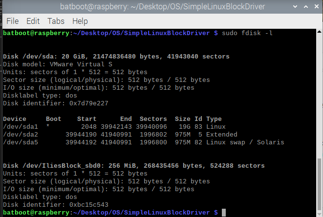
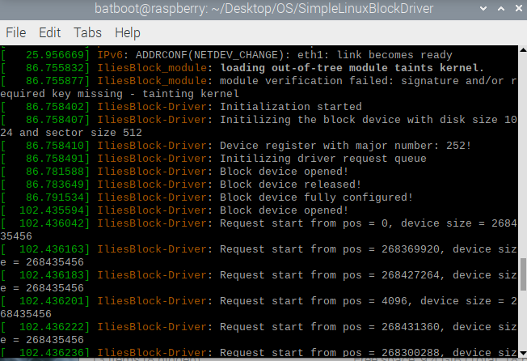

# Simple Linux Block Device Driver

**Author: Alexandru Ilies**

## **Disclaimer!**

This is the result of a research-based university project. All the provided materials are based on multiple sources that are attached to this document. This device driver has limited capabilities and it **is by no means for practical use** in any scenario. The intent of this project is to show **knowledge and developed skills** over the topic of `Linux-System Device Drivers`

## Introduction

A `Linux Block Device Driver` is a specialized type of driver that allows for random access manipulation of data on a **fixed-size** block of memeory. This type of driver has a specific and important place in the `Linux Kernel`, therefore it has a unique interface and capabilities.

The purpose of such a device is to efficiently handle larger data transfers between storage unit memory and core memory. The highlight of a block device driver is `efficiency` over the transfer of data. This simple linux block device driver, while probably not the best example, is still a great display of moving bigger amounts of data in an efficient manner.

It is also important to mention the fact that `Linux Kernel` went through a fundamental change starting `Linux 5.x`. In this version of Linux the standard of `Device Drivers` has changed, therefore most old block device drivers are not compatible with the modern Linux Systems.

Most operations on the `Block Device Driver` are handled by a **Request Queue**, which takes care of the order and execution of each request (reading and writing). This Simple Linux Device Driver features a simple Request Queue that can handle the basic reading and writing to a sector.

In the end, the final `virtual storage unit` cannot be partitoned, therefore not usable as a real storage unit. That is sadly because such an implementation would require a more thorough implementation, disproving the **Simple** attribute of the project. However, the created unit is detected with all the information about full capacity, sector size and sector numbers by the Linux Kernel.

## How to use

In order to use the `block device driver` the project needs to:
- Compile for the linux kernel
- Kernel module has to be loaded
- Kernel module has to be unloaded (if necessary)
- Work directory needs to be clean (if necessary)

Those operations are handled by the **Makefile**. All the commands can be executed on a Linux-based system using the command:

```bash
    sudo make -f Makefile [command]
```

All the commands:
- all - compile the code as a `loadable Kernel module`
- load - `load` the module into the Kernel
- unload - `unload` the module from the Kernel
- clean - `clean` the work directory

## Project Results

As a result, the `block device driver` can be compiled and shown using:

```bash
sudo fdisk /dev/IliesBlock_sbd0
```



Or by refering to the `Kernel Log file`

```bash
sudo dmesg
```



## References

- [O'Reilly's Linux Device Drivers, 3rd Edition](https://www.oreilly.com/library/view/linux-device-drivers/0596005903/ch16.html)

- [OLEG KUTKOV PERSONAL BLOG](https://olegkutkov.me/2020/02/10/linux-block-device-driver/)

- [Linux Kernel Labs](https://linux-kernel-labs.github.io/refs/heads/master/labs/block_device_drivers.html)

- [LWN.net](https://lwn.net/Articles/58720/)